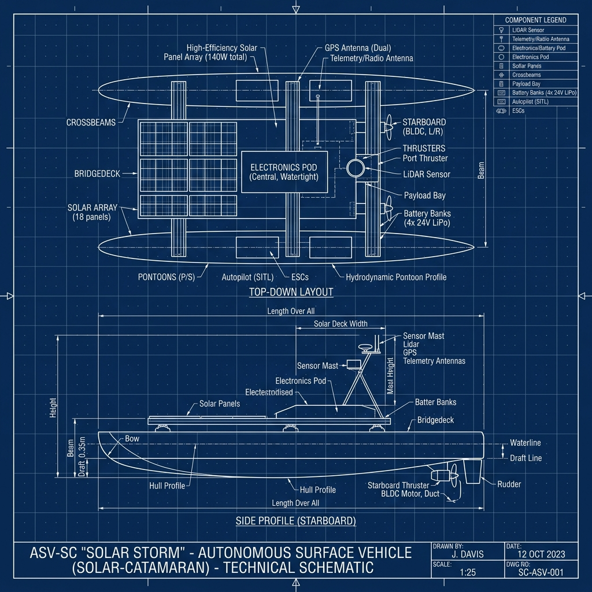
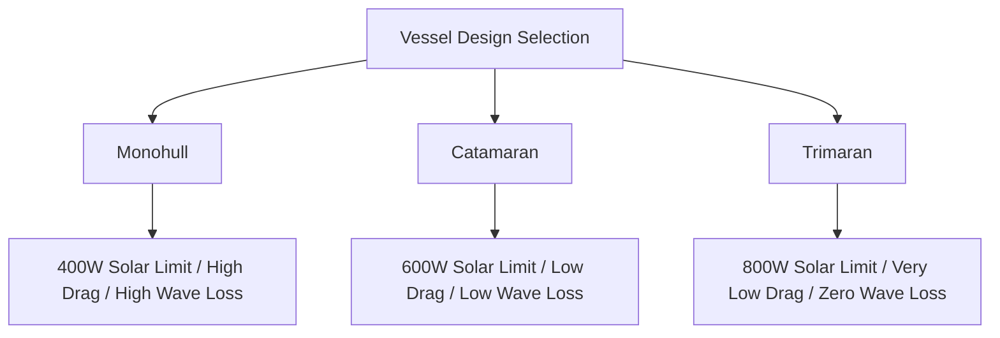

# Systems Engineering & Vessel Design Document
## Project Blue-Water Rover: Long-Range Solar ASV (ESD-01)

This document details the physical, electrical, and computational design of the Blue-Water Rover Autonomous Surface Vehicle (ASV) optimized for an unassisted 650–700 nautical mile voyage from Charleston, SC, to Tampa Bay, FL.



---

## 1. Hull Selection & Hydrodynamics

Selecting the optimal hull shape represents the fundamental trade-off in solar-electric vessel design. We evaluate three configurations:

| Metric | Monohull (Deep-V) | Catamaran (Dual-Pontoon) | Trimaran (Stabilized Outriggers) |
| :--- | :--- | :--- | :--- |
| **Drag Coefficient (\(C_d\))** | 1.20 (Base) | 0.85 (Low) | 0.75 (Very Low) |
| **Solar Deck Area** | Max 400W | Max 600W | Max 800W |
| **Hull Weight** | 45 kg | 60 kg | 75 kg |
| **Transverse Stability** | Low (Heels in wind/waves) | High (Resists heeling) | Very High (Highly stable) |
| **Wave Roll Sensitivity** | High (Wave action shades panels) | Low (Maintains flat deck) | Minimal (Near-constant solar angle) |



### Recommendation
> [!IMPORTANT]
> The **Catamaran** is selected as the optimal baseline design. It provides a wide, flat deck area to accommodate up to **600W** of flexible solar panels, achieves a **15% reduction in drag** compared to a monohull, and minimizes transverse roll which directly prevents solar panel shading in open water.

---

## 2. Power Architecture & Sizing

The ASV operates on a closed-loop energy cycle. The power balance equation is defined as:
\[P_{net} = P_{solar} \cdot \eta_{mppt} - (P_{propulsion} + P_{edge} + P_{sensors})\]

### 2.1 Daily Energy Consumption
The continuous power draw for the subsystems is calculated as follows:
* **Edge Compute + Avionics**: \(12\text{V} \times 1.8\text{A} = 21.6\text{W}\) (Pi 5 baseline)
* **Sub-Avionics & Sensors**: \(12\text{V} \times 0.7\text{A} = 8.4\text{W}\) (RTK-GPS, IMU, LoRa transceiver)
* **Propulsion (Cruising Speed)**: \(48\text{V} \times 1.25\text{A} = 60\text{W}\)

\[P_{loads} = 21.6\text{W} + 8.4\text{W} + 60\text{W} = 90\text{W}\]
\[\text{Daily Consumption} = 90\text{W} \times 24\text{ hours} = 2,160\text{ Wh/day}\]

### 2.2 Battery Bank Sizing (LiFePO4)
To ensure system survival during stormy conditions, we design for **2 days of complete autonomy** at a maximum **80% Depth of Discharge (DoD)**:

\[\text{Required Battery Capacity} = \frac{2,160\text{ Wh/day} \times 2\text{ days}}{0.8} = 5,400\text{ Wh}\]

Standardized to our 48V system:
\[\text{Battery Capacity (Ah)} = \frac{5,400\text{ Wh}}{48\text{V}} = 112.5\text{ Ah}\]
* **Selected Battery**: **48V 115Ah LiFePO4 bank** (5,520 Wh capacity).

### 2.3 Solar Array Sizing & Solar Deficit
Assuming a conservative **5 Peak Sun Hours** per day along the Florida coast, and a **75% efficiency coefficient** (due to panel pitch, splash residue, and temperature losses):

\[\text{Required Solar Power} = \frac{2,160\text{ Wh}}{5\text{ hours} \times 0.75} = 576\text{ W}\]

> [!WARNING]
> **The 400W Sizing Gap**: The initial 400W solar panel configuration can generate at most \(400\text{W} \times 5 \times 0.75 = 1,500\text{ Wh/day}\), leaving a daily deficit of **660 Wh**.
> To resolve this without manual refueling:
> 1. Expand the solar deck area to a **600W array** (requires Catamaran/Trimaran hull).
> 2. Implement **Software Propulsion Throttling** to automatically reduce motor power during low-light/overcast days.

---

## 3. Propulsion & Differential Actuation

The vessel utilizes **dual 48V brushless underwater thrusters** mounted in a differential steering configuration. This eliminates the mechanical failure points of a traditional rudder servo.

```
       [Left Thruster]  =======\
                                \=======> Forward Thrust & Differential Steering
       [Right Thruster] =======/
```

* **Differential Heading Formula**:
  The rate of rotation \(\omega\) is proportional to the difference in thrust between the left and right thrusters:
  \[\omega \propto (T_{right} - T_{left}) \cdot L_{beam}\]
  Where \(L_{beam}\) is the vessel's beam width.
* **Propulsion Speed Power Curve**:
  \[V_{boat} = V_{max} \cdot \sqrt{\frac{P_{thrust}}{P_{max}}}\]
  A cruise throttle of 60W drives the boat at approximately 5.0 knots.

---

## 4. Edge Avionics & Navigation Stack

The software stack utilizes a hybrid isolation architecture to guarantee system stability:

```
+-------------------------------------------------------------+
|               HIGH-LEVEL MISSION CONTROL (Edge SBC)         |
|   Sensors: RTK-GPS, IMU, Optical Cameras, Radar             |
|   Tasks: COLREGs Avoidance, Path Finding, Telemetry Uplink  |
+-------------------------------------------------------------+
                              | (SPI/UART isolated link)
                              v
+-------------------------------------------------------------+
|              LOW-LEVEL ACTUATOR CORE (STM32 MCU)            |
|   Tasks: Motor throttle PWM, Loiter PID, Keepalive Watchdog |
+-------------------------------------------------------------+
```

### 4.1 Collision Avoidance (COLREGs Compliance)
Using the Edge Compute board, the vessel processes sensory data to avoid coastal marine hazards:
1. **STM32 Only**: Static waypoint follower. No avoidance.
2. **Raspberry Pi 5 / Jetson Orin Nano**: Active vector steering. If an obstacle is detected within 15 NM, the high-level navigator computes an avoidance offset:
   \[\theta_{avoid} = \theta_{target} + \frac{K_{avoid}}{d_{obstacle}} \cdot \text{sign}(\phi)\]
   Where \(d_{obstacle}\) is the distance, and \(\phi\) is the angle to the obstacle center relative to the course.

---

## 5. Telemetry & Communications Mesh

The telemetry system utilizes a low-power **MeshCore LoRa transceiver** operating on the 915 MHz band, configured as a low-power **Companion Node**.

* **Backbone repeater hop network**: 15 onshore mesh repeaters skip telemetry packets from the boat back to the Charleston metro hub command station.
* **Link Budget**:
  - Max direct range: 45 nautical miles over flat ocean water.
  - Frequency: 915 MHz Spread Spectrum (LoRa).
  - Sleep Cycle: The Companion Node wakes up every 10 seconds to check for incoming discrete command packets (`NAV:WP`, `NAV:HOLD`, `NAV:KILL`) and broadcasts a telemetry payload (`TEL:DIAG`) only upon change in ship state or every 5 minutes.

---

## 6. Vessel Construction Plans

This section serves as the fabrication blueprint and assembly manual for constructing the optimized catamaran ASV.

### 6.1 Mechanical Frame & Hull Integration
1. **Pontoon Preparation**: Select dual rotomolded UV-resistant high-density polyethylene (HDPE) pontoons (length: 2.2m, beam diameter: 0.25m). Mold integrated threaded brass inserts on the upper deck of each pontoon to serve as crossbeam anchor points.
2. **Crossbeam Assembly**: Cut four lengths of 40mm x 40mm T-slot anodized aluminum structural extrusions (80/20 profile). Bolt these crossbeams transversely across the pontoons using M8 marine-grade 316 stainless steel bolts with nylon-insert lock nuts.
3. **Bridge Deck Installation**: Secure a 3.5mm thick carbon-fiber composite sheet across the middle three crossbeams. Apply marine silicone sealant (e.g., 3M Marine Adhesive Sealant 4000UV) along the extrusion channels before fastening to eliminate vibration and squeaking.

### 6.2 Watertight Power Vault (Central Box)
1. **Box Selection**: Utilize an IP67-rated polycarbonate enclosure (minimum size: 400mm x 300mm x 180mm).
2. **Pressure Equalization**: Install a waterproof gore-tex ventilation plug (e.g., Amphenol Vent Gland) to equalize air pressure during temperature changes without allowing humidity or sea water ingress.
3. **Internal Component Layout**:
   - Secure the 48V 115Ah LiFePO4 battery bank to the floor of the box using heavy-duty hook-and-loop straps anchored to epoxy-reinforced eyelets.
   - Mount the MPPT solar charge controller to an internal aluminum cooling plate that contacts the bottom of the enclosure to conduct heat outward into the wet hull deck.
   - Place a marine-grade MRBF (Marine Rated Battery Fuse) block directly on the battery positive terminal (fuse rated for 1.25x max expected system surge current).
4. **Waterproof Pass-Throughs**: Drill holes for all cables (solar input, motor output, system power out) and install PG-9 and PG-13 nickel-plated brass cable glands with rubber compression gaskets.

### 6.3 Propulsion Steering Mounts
1. **Clamp Machining**: Machined custom brackets from 15mm thick marine grade acetal (Delrin) or 3D-printed PETG (solid infill, 8 perimeter walls).
2. **Thruster Rigging**: Mount the brushless thrusters into the brackets and secure them to the stern aluminum crossbeam, spaced exactly 0.9m apart to maximize the differential steering torque vector.
3. **Conduit Guide**: Encase the thruster power lines in flexible split-loom UV-resistant nylon conduit. Clip the conduit along the pontoon decks to prevent contact with coastal seagrass or marine debris.

### 6.4 Electronics Avionics Housing
1. **RF Isolation & Compartments**: Place the Raspberry Pi 5/Jetson Orin Nano and STM32 MCU inside a separate IP67 electronics enclosure, physically separated from the high-voltage battery vault to mitigate RF noise.
2. **Dampening Mounts**: Mount the electronics board using rubber vibration isolation standoffs (M3 bobbin mounts) to insulate the sensitive inertial measurement unit (IMU) and computer processor from high-frequency hull vibration caused by wave impacts.

### 6.5 Mast Assembly & Sensor Rigs
1. **Mast Structure**: Construct a 1.2m vertical mast using a 25mm diameter lightweight carbon-fiber tube. Insert the mast base into a reinforced aluminum deck socket bolted directly to the forward deck crossbeam.
2. **Head Rigging**: Mount the RTK-GPS receiver antenna, the 915 MHz LoRa whip antenna, and optical camera housing to the top mast bracket. Run the shielded signal cables down the interior of the hollow carbon fiber mast tube, emerging through a waterproof cable entry gland at the base.
3. **Grounding & Shielding**: Ground all cable shields and the aluminum frame to a common negative bus bar connected to a sacrificial zinc anode mounted below the water line on the transom to prevent galvanic corrosion.
