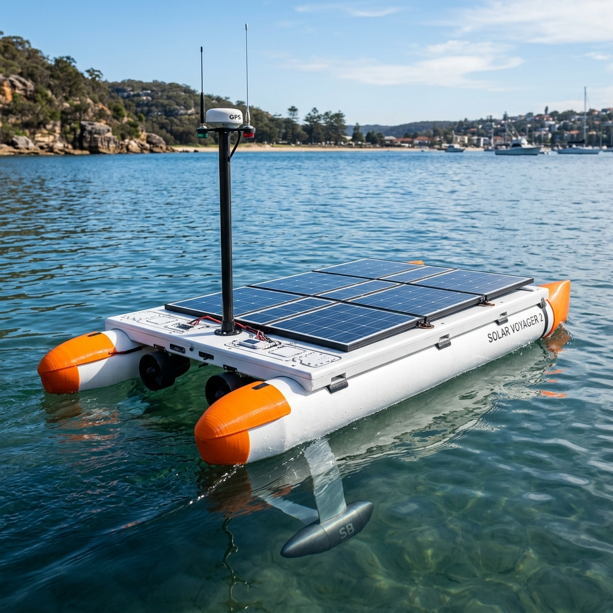
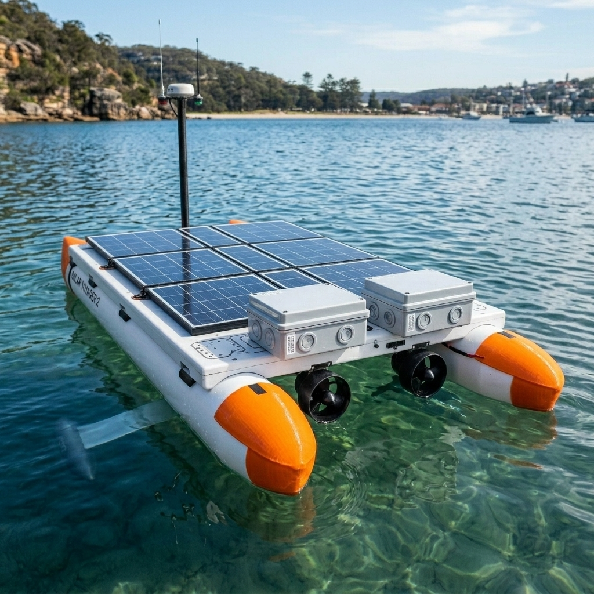
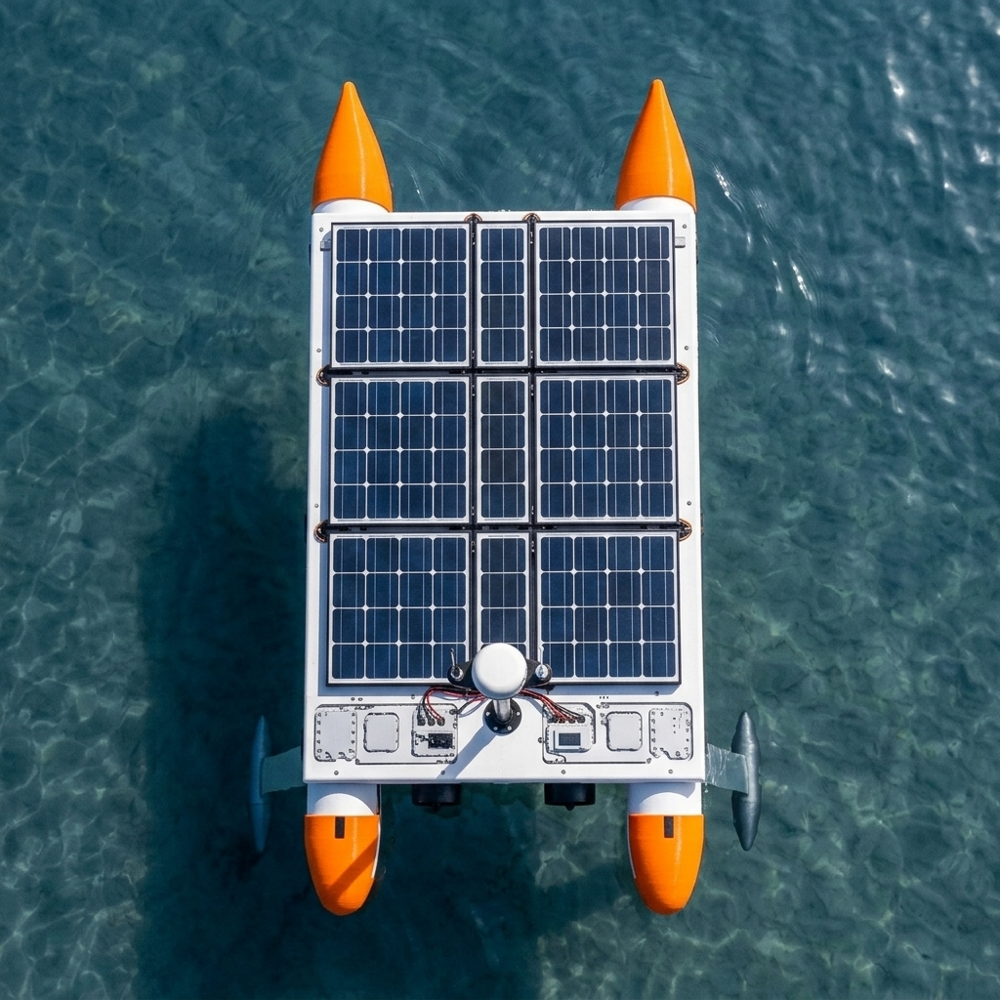
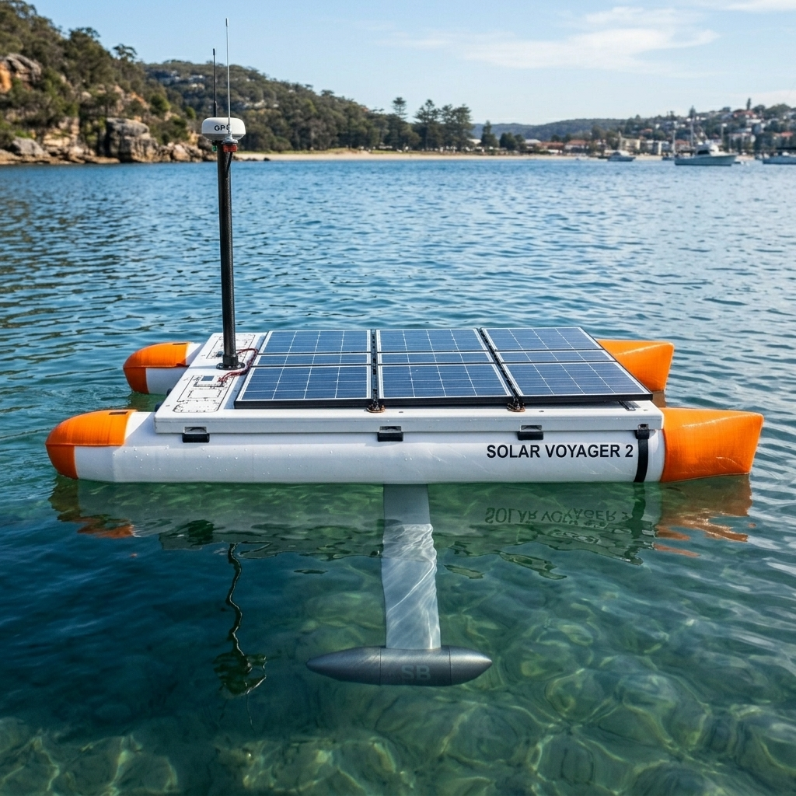

# Design Specification Document (ESD-01-F)
## Project Blue-Water Rover: Option F (Hydro-Stabilized Ocean Catamaran)
## Revision: 1.0



This document outlines the detailed mechanical, electrical, and telemetry specifications for the Option F (Hydro-Stabilized Ocean Catamaran) configuration of the Blue-Water Rover ASV. Option F is a highly refined, seaworthy hybrid design incorporating the lessons of historical transoceanic crossings and resolving the critical structural, waterproofing, and steering vulnerabilities of Option E. It is optimized for a $650\text{–}700\text{ NM}$ open-ocean voyage from Charleston, SC, to Tampa Bay, FL, while remaining constructible within a standard apartment workshop using off-the-shelf PVC, 2020 extrusions, and 3D printing.

---

## 1. Physical & Hydrodynamic Specifications

### 1.1 Dimensions & Hull Layout
*   **Outboard Pontoons**: Dual 6-inch (150mm nominal / $168.3\text{mm}$ OD) SDR-35 PVC pipes, $2.53\text{m}$ length, spaced **$800\text{mm}$ center-to-center** (overall beam width of $1.0\text{m}$ at the frame, and $1.2\text{m}$ including the hulls).
*   **Aerodynamic Bow Caps**: Custom 3D-printed **ASA** nose cones cemented to the front of each PVC pontoon. The bows feature a sharp, wave-piercing entry profile designed to slice through swells and prevent seaweed accumulation.
*   **Swept-Back Foil Keel Fin**: A high-strength, swept-back flat metal foil plate (6061-T6 aluminum or 316 stainless steel, $8\text{mm}$ thickness, $400\text{mm}$ height) slung centerline. The fin is swept back at a **$45^\circ$ rake angle** so sargassum, weeds, and fishing lines naturally slide down and shed off the bottom.
*   **Submerged Lead Ballast Bulb**: A compact, streamlined lead bulb ($100\text{mm}$ diameter, $500\text{mm}$ length, slung at $z = -450\text{mm}$ below the water line). Weight: **$15.0\text{ kg}$** of solid lead ballast encased in a fiberglass/epoxy protective shroud with a 3D-printed ASA nose/tail cone. The bulb contains **zero electrical or chemical components**.
*   **Solar Deck Size**: $1.4\text{m}$ width $\times 2.0\text{m}$ length ($2.8\text{ m}^2$) made of $4\text{mm}$ white Coroplast sheets secured to 2020 aluminum rails. The deck overhangs the frame by $200\text{mm}$ on both sides.
*   **Total Dry Mass**: $\approx 96.5\text{ kg}$ (Payload: $85\text{ kg}$ + Hulls/Frame: $11.5\text{ kg}$).
*   **Hydrodynamic Draft**: **$\approx 50\text{–}53\%$** under full $96.5\text{ kg}$ load (waterline at the vertical center of the hulls). 
    *   *Justification*: By moving the $35\text{ kg}$ battery vault to the deck and spacing the hulls apart, the boat floats at its hydrodynamic sweet spot. This keeps the overhanging solar deck clean of splashes, minimizes wave-making resistance, and avoids solar cell shading.

### 1.2 Self-Righting & Stability Physics
*   **Center of Buoyancy ($B$)**: Located near the centerline at the waterline ($z \approx -84\text{mm}$).
*   **Center of Gravity ($G$)**: Located at $z \approx -180\text{mm}$. By hanging a $15\text{ kg}$ lead bulb at $z = -450\text{mm}$, the Center of Gravity is pulled well below the Center of Buoyancy despite the battery bank being mounted on the deck.
*   **Auto-Recovery Righting Moment**: If rolled past $90^\circ$ or completely capsized ($180^\circ$), the $15\text{ kg}$ lead ballast creates a powerful self-righting torque (Righting Arm $GZ \approx 270\text{mm}$). The buoyancy of the closed, empty PVC hulls pushes upward while the lead weight pulls downward, immediately self-righting the vessel. The overhanging Coroplast deck is designed with a slight camber (curved arch) to prevent water pooling and ensure it sheds water instantly during recovery.

---

## 2. Power & Electrical Architecture

### 2.1 Deck-Mounted Watertight Power Vault
*   **Battery Relocation**: The $48\text{V } 115\text{Ah}$ LiFePO4 battery bank ($35\text{ kg}$) is housed in a heavy-duty, IP67-rated polycarbonate enclosure mounted securely on the **aft-left deck**, directly over the structural aluminum frame.
*   *Safety & Thermal Design*: Moving the batteries out of the submerged bulb keeps them completely free of hydrostatic pressure risks. The box is equipped with a Gore-Tex breathing vent to prevent pressure differences due to temperature changes and contains non-flammable packing foam to secure the cells.
*   *Avionics Isolation*: High-voltage power lines are run in shielded conduits. The edge autopilot and LoRa/satellite electronics are housed in a **separate IP67 box on the aft-right deck** to isolate sensitive signals from high-current electrical noise.

### 2.2 Solar Array & Charging Redundancy
*   **Solar Array**: Eight $100\text{W}$ flexible monocrystalline solar panels ($540\text{mm} \times 1050\text{mm}$) arranged in a 4x2 grid on the flat Coroplast deck.
*   **Redundant Dual MPPT**: The array is split into two independent $400\text{W}$ charging circuits:
    *   *Circuit 1*: Left-side panels (4 panels) connected to **Victron SmartSolar MPPT 75/15 #1**.
    *   *Circuit 2*: Right-side panels (4 panels) connected to **Victron SmartSolar MPPT 75/15 #2**.
    *   *Justification*: If the sensor mast casts a shadow on one side of the boat, or if one solar controller fails, the other side continues harvesting power at full efficiency, maintaining battery charging.

---

## 3. Propulsion & Steering (Rudderless Redundancy)

*   **Dual Transom-Mounted Thrusters**: Two BlueRobotics T200 brushless underwater thrusters mounted directly to the stern transoms of the left and right PVC pontoons (spaced exactly $800\text{mm}$ apart).
*   **Motor Construction**: Fully potted stators with water-lubricated ceramic bearings. No dynamic shaft seals or oil-filled chambers, completely eliminating water ingress and wear issues.
*   **Rudderless Differential Steering**: Directional control is achieved entirely by varying the thrust difference between the left and right motors:
    \[\omega \propto (T_{right} - T_{left}) \cdot 0.8\text{m}\]
*   **Redundancy Analysis**: 
    *   *Rudder Elimination*: By removing the mechanical rudder, Savox steering servo, linkages, and rubber sealing boot, we eliminate the primary failure point seen in *SeaCharger*.
    *   *Failure Tolerance*: If one thruster fails due to debris or motor lockout, the autopilot enters a **Single-Thruster Safe-Return Mode**, pulsing the remaining thruster and using short reverse thrust cycles to crab/steer the vessel back to the nearest coastal waypoint using the satellite link.

---

## 4. Telemetry & Communications

*   **Three-Tier Avionics Core**:
    *   *High-Level Perception (Jetson Orin Nano)*: Runs Ubuntu, ROS2, and custom depth-clustering/YOLO models to process 3D depth feeds from the Intel RealSense D455 camera for COLREGs obstacle avoidance. Powered ON/OFF dynamically.
    *   *System Companion (Raspberry Pi 4 Model B)*: Runs 24/7. Manages telemetry parsing, interfaces with cellular/satellite/LoRa modems, and duty-cycles power to the Jetson.
    *   *Autopilot Core (Pixhawk 6X)*: Runs an RTOS (ArduPilot/PX4). Handles low-level differential thruster steering PID loops, navigation waypoints, and sensor fusion.
    *   *Safety Supervisor (Arduino Nano)*: Minimal power watchdog board. Polls environmental sensors (leaks/humidity) and can power-cycle frozen compute boards.
*   **Multi-Link Telemetry Suite**:
    *   *Primary Coastal (MeshCore LoRa)*: Heltec V3 node operating at 915 MHz for ground station links up to 45 NM offshore.
    *   *High-Speed Local (5G Modem)*: USB dongle connected to the Pi 4 for high-bandwidth remote operations near ports.
    *   *Backup Satellite (RockBLOCK 9603 Iridium)*: Global satellite transceiver transmitting diagnostic heartbeats and emergency commands in deep ocean.
*   **Dual GPS-for-Yaw**: Dual Holybro H-RTK F9P GPS units spaced longitudinally on the frame. Calculates GPS-based heading (carrier-phase differential) to eliminate electromagnetic compass interference.
*   **System Power Consumption**: Draws $\approx 6.0\text{ W}$ in Transit Mode (Pi 4 + Pixhawk + Comms active) and peaks at $\approx 20.5\text{ W}$ in Avoidance Mode (Jetson + D455 fully active).

---

## 5. Apartment-Scale Bill of Materials (BOM)

| Component Category | Description | Qty | Est. Cost |
| :--- | :--- | :--- | :--- |
| **Outboard Pontoons** | 6-inch SDR-35 Thin-Walled PVC Sewer Pipe (10 ft length) | 2 | \$60 |
| **Outboard Pontoons** | 6-inch PVC Domed End-Caps (Stern only) | 2 | \$20 |
| **Keel Foil & Ballast** | 8mm 6061-T6 Aluminum Plate (machined hydrofoil) | 1 | \$60 |
| **Keel Foil & Ballast** | Cast Lead Ballast Weight (15 kg, streamlined cylinder) | 1 | \$45 |
| **3D Printed Parts** | Custom single-nosed 6" pontoon bow caps (ASA) | 2 | \$30 (filament) |
| **3D Printed Parts** | Keel root connection block & foil clamp (ASA) | 1 | \$20 (filament) |
| **Structure** | 2020 (20mm x 20mm) T-Slot Anodized Aluminum Extrusions | 6 | \$80 |
| **Deck** | 4mm White Coroplast Sheet ($1.4\text{m} \times 2.0\text{m}$) | 1 | \$25 |
| **Power** | 48V 115Ah LiFePO4 battery cells (cylindrical) | 16 | \$900 |
| **Power** | IP67 Heavy-Duty Polycarbonate Enclosures (Deck Boxes) | 2 | \$70 |
| **Power** | Victron SmartSolar MPPT Charge Controller | 2 | \$160 |
| **Solar** | Renogy 100W Flexible Solar Panel | 8 | \$800 |
| **Propulsion** | BlueRobotics T200 Brushless Thruster | 2 | \$500 |
| **Electronics** | Pixhawk 6X Flight Controller & Power Module | 1 | \$380 |
| **Electronics** | Raspberry Pi 4 Model B (4GB) | 1 | \$55 |
| **Electronics** | Jetson Orin Nano Developer Kit (8GB) | 1 | \$399 |
| **Electronics** | Arduino Nano (3.3V) & MOSFET power board | 1 | \$25 |
| **Electronics** | Intel RealSense D455 Depth Camera (with IP67 dome housing) | 1 | \$380 |
| **Electronics** | Dual Holybro H-RTK F9P GPS Units | 2 | \$440 |
| **Telemetry** | Heltec V3 LoRa + RockBLOCK 9603 + USB 5G Modem | 1 | \$420 |
| **Total Est. Cost**| | | **\$4,870** |

---

## 6. Assembly & Construction Instructions

1.  **Hull Preparation**: Cut the two 6-inch SDR-35 PVC pipes to $2.53\text{m}$. Use PVC primer and cement to secure standard PVC end-caps to the stern transoms. Cement the 3D-printed ASA wave-piercing bow caps to the front of each hull.
2.  **Keel Foil Installation**: Bolt the machined $8\text{mm}$ aluminum foil keel spar to the centerline of the aluminum frame using the 3D-printed root collar. Bolt the $15\text{ kg}$ lead ballast bulb to the bottom of the spar, securing it with locknuts and wrapping it in a thin layer of epoxy fiberglass to prevent galvanic corrosion.
3.  **Frame & Bracket Assembly**: Assemble the 2020 aluminum crossbeams ($1.2\text{m}$ width) and long rails ($1.9\text{m}$ length). Clamp the frame to the PVC pontoons at $800\text{mm}$ spacing using the custom single-hull mounting brackets cushioned with rubber friction strips.
4.  **Propulsion Mounting**: Bolt the dual BlueRobotics T200 thrusters to the stern transoms of the left and right pontoons. Route the potted power cables along the hulls inside nylon protective conduit and pass them through IP67 glands into the deck boxes.
5.  **Deck and Enclosures Setup**: Mount the $4\text{mm}$ Coroplast deck sheet to the extrusion frame. Bolt the two IP67 deck boxes: the battery vault on the aft-left and the single control avionics box on the aft-right. Secure the LiFePO4 cells inside the battery vault using EPDM foam padding. Mount the Pi 4, Jetson Orin Nano, Pixhawk 6X, and Arduino watchdog inside the control box, ensuring the Jetson heatsink is thermally coupled to the external aluminum heat spreader.
6.  **Solar Array Installation**: Lay out the 8 flexible panels in a 4x2 grid on the deck. Secure them using marine-grade rivets or outdoor zip-ties through the panel eyelets. Route the cables through glands into the avionics box, connecting them to the dual MPPT charge controllers.
7.  **Mast and Camera Setup**: Bolt the $1.2\text{m}$ vertical mast socket to the front center of the aluminum frame. Mount the Intel RealSense D455 in a waterproof dome on the bow or mast. Run the shielded USB 3.0 cable back to the Jetson Orin Nano inside the control box. Mount the dual F9P RTK GPS antennas spaced along the frame, and run their coax cables to the Pixhawk 6X. Route the LoRa, 5G, and Satellite antennas up the carbon fiber mast and connect them to the control box bulkheads.

---

## 7. Rendered Design Views

The following carousel provides multiple high-fidelity perspectives of the Option F design, illustrating the mechanical layout, propulsion configuration, and underwater profile.

````carousel

<!-- slide -->

<!-- slide -->

<!-- slide -->

````

