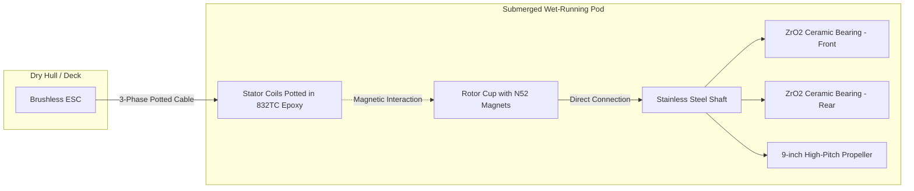
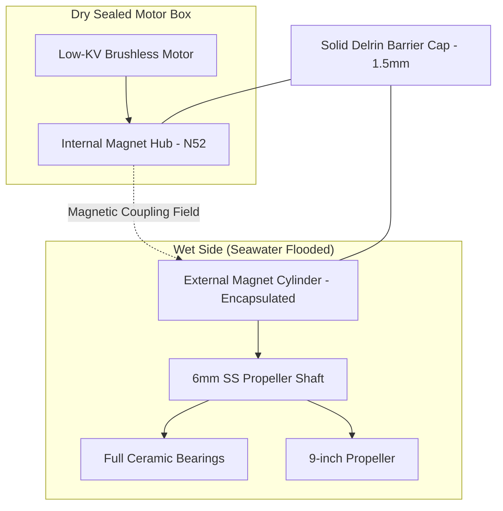

# Design Specification Document (ESD-02-HYBRID)
## Project Blue-Water Rover: High-Efficiency Hybrid Propulsion Pod
## Revision: 1.0

This document outlines the detailed mechanical, hydrodynamic, and electrical specifications for the **High-Efficiency Hybrid Propulsion Pod** for the Blue-Water Rover ASV. This system combines the extreme durability of seal-less brushless motor technology with the fluid dynamic efficiency of a large-diameter, low-RPM propeller, optimized for sustained cruising in the 3–5 knots range.

---

## 1. Executive Summary & Design Goals

Standard ROV thrusters (such as the BlueRobotics T200) are optimized for static thrust (bollard pull) and compact packaging, utilizing small, high-RPM propellers (96 mm diameter). At cruising speeds of 3–5 knots, this results in excessive slip and low efficiency (~ 35–40\%). 

To achieve multi-day transoceanic crossings on solar power, the propulsion system must operate at peak efficiency. This specification details two hybrid design paths to achieve a target propulsion efficiency of **60–70\%** while maintaining complete waterproofing integrity for a ~ 100 kg displacement vessel:

*   **Design Option A: Potted Wet-Running Direct-Drive (Flooded Rotor)**: Re-engineers an outrunner brushless motor to run fully flooded in seawater by vacuum-potting the stator in epoxy, replacing steel bearings with full ceramics, and driving a large propeller directly.
*   **Design Option B: Coaxial Magnetic Coupling (Dry Motor)**: Houses a standard low-KV brushless motor in a dry, sealed chamber and transfers torque to an external propeller shaft through a solid plastic pressure barrier using a neodymium Halbach array.

---

## 2. Propulsion Hydrodynamics & Propeller Sizing

### 2.1 Propeller Disk Loading & Sizing Calculations
According to Froude's momentum theory, the ideal actuator disk efficiency (\eta_i) is calculated as:
\eta_i = \frac{2}{1 + \sqrt{1 + \frac{T}{\frac{1}{2} \rho A V²}}}

Where:
*   T = Thrust (15 N at 3 kts, 30 N at 4 kts, 70 N at 5 kts)
*   \rho = Water density (1000 kg/m^3)
*   A = Propeller swept area (\frac{pi D²}{4})
*   V = Cruising speed (3 kts ~ 1.54 m/s, 4 kts ~ 2.06 m/s, 5 kts ~ 2.57 m/s)

For a **230 mm (9.0 inch)** diameter propeller compared to a **96 mm (3.8 inch)** propeller, the swept area increases by **570\%**:
*   A_96mm = 0.0072 m²
*   A_230mm = 0.0415 m²

At 4 knots and 30 N of thrust:
*   **Ideal Efficiency (96 mm)**: **73.5\%** (Real-world efficiency: **~ 40\%** due to nozzle drag and tip losses).
*   **Ideal Efficiency (230 mm)**: **92.6\%** (Real-world efficiency: **~ 65\%** due to optimized blade geometry and low slip).

### 2.2 Motor KV & Gear Selection
To match the propeller's advance speed without cavitation, the propeller must spin at a low rotational velocity:
*   Target RPM at 4 knots (with a 6-inch pitch propeller): ~ 1,200–1,500 RPM under load.
*   Operating Voltage: 48V nominal.
*   Required Motor KV: To avoid using complex, high-wear gearboxes or belt drives, the motor must be **directly driven** by selecting a low-KV outrunner motor (**50–100 KV** range, e.g., a brushless gimbal or skateboard motor).

---

## 3. Design Option A: Potted Wet-Running Direct-Drive (Flooded Rotor)

This design allows seawater to flood the rotor cavity, using the water directly as a bearing lubricant and stator coolant. It contains only one moving part (the rotor assembly).

### 3.1 Stator Encapsulation & Potting Process
1.  **Stator Selection**: Select a 50mm outrunner stator with thick laminations. Remove any standard paper insulation and clean with isopropyl alcohol.
2.  **Epoxy Selection**: Use **MG Chemicals 832TC** thermally conductive epoxy (thermal conductivity: 1.44 W/(m * K)). This provides high electrical resistance while ensuring heat from the windings is conducted directly to the surrounding seawater.
3.  **Vacuum Degassing**: Mix the two-part epoxy and place it in a vacuum chamber at -29 in Hg for 10 minutes to remove all air bubbles.
4.  **Mold Casting**: Place the stator in a custom 3D-printed silicone mold. Pour the degassed epoxy over the coils, ensuring it fully saturates the gaps between the teeth. Cure at 65°C for 4 hours.
5.  **Windage Reduction**: Grind the cured stator surface to a smooth cylinder on a lathe, maintaining a stator-to-rotor air gap of exactly 0.5 mm.

### 3.2 Ceramic Bearing Specifications
Standard steel bearings fail rapidly in marine environments due to oxidation and galvanic corrosion. They must be replaced:
*   **Material**: **Full Zirconium Dioxide (ZrO_2)** ceramic inner/outer rings and balls, with a Polytetrafluoroethylene (PTFE) cage.
*   **Lubrication**: None (run completely dry/water-lubricated).
*   **Shielding**: Open (no shields or seals) to allow silt and water to flush through the bearing races freely.
*   **Clearance**: C3 clearance to accommodate thermal expansion and small particles.

### 3.3 Rotor and Magnet Corrosion Proofing
1.  **Magnet Treatment**: Neodymium (NdFeB) magnets are extremely vulnerable to rust. Use **N52SH** (high temperature/coercivity) magnets with a Nickel-Copper-Nickel coating.
2.  **Encapsulation Sleeve**: Glue the magnets into the rotor cup using marine-grade epoxy. Apply a thin outer wrap of **0.2mm carbon-fiber prepreg tape** or press-fit a **0.15mm Grade 2 Titanium sleeve** over the magnets. This creates a mechanical barrier preventing magnet swelling or delamination under water pressure.

### 3.4 Silt and Marine Debris Protection
*   **Labyrinth Seal**: A custom 3D-printed ASA labyrinth ring (interlocking concentric rings) is installed on the front and rear of the rotor cup. This forces water to take a winding path to enter the rotor cavity, preventing sand, silt, and sea grass from entering the magnet air gap.

### 3.5 Hydrodynamic Windage & Viscous Shear Loss Minimization
*   **Viscous Shear Losses**: Because water is ~ 800 x  denser and ~ 55 x  more viscous than air, rotating a flooded rotor cup in water creates significant shear-layer drag. The viscous shear stress (\tau) in the stator-rotor air gap is modeled as:
    \tau = \mu \frac{omega R}{g}
    where \mu is the dynamic viscosity of water (1.002  x  10^{-3} Pa * s at 20°C), omega is angular velocity (rad/s), R is rotor radius, and g is the radial air gap.
*   **Power Loss Equation**: The total shear power loss (P_shear) inside the air gap of length L is:
    P_shear = \frac{2pi \mu L R^3 omega²}{g}
*   **Air Gap Optimization**: Since shear loss scales with the cube of the radius (R^3) and is inversely proportional to the gap (g), keeping the motor diameter compact (<= 50 mm) and widening the radial air gap from the typical 0.3 mm (air spec) to **0.8 mm** reduces viscous drag by **62.5\%** while only sacrificing ~ 12\% of the motor torque constant (K_t).

### 3.6 ESC Firmware & Commutation Tuning (FOC vs. Trapezoidal)
*   **Field Oriented Control (FOC)**: Standard trapezoidal ESCs struggle to start a flooded outrunner due to the heavy startup damping of water. A VESC or AM32 ESC operating in sensorless FOC mode is required. FOC applies sinusoidal currents to track the rotor position down to 0 RPM, providing the high starting torque needed to break the propeller loose.
*   **ESC Parametric Tuning**:
    *   *Startup Power Boost*: Increase startup current bias by 30\% to overcome static inertia and fluid damping.
    *   *Minimum ERPM*: Set the minimum electrical RPM to 150 ERPM to prevent commutation stalling at low speeds.
    *   *Observer Gain*: Increase the sensorless observer gain by 50\% to maintain tracking stability in high-density media.

### 3.7 Galvanic Protection & Sacrificial Anodes
*   **Galvanic Cell Creation**: The carbon fiber spar, aluminum rotor cup, stainless steel shaft, and copper stator coils form a galvanic circuit in saltwater.
*   **Sacrificial Anode**: A **50 g ring-type zinc anode** must be clamped onto the exposed portion of the stainless steel propeller shaft behind the rotor cup. The zinc will corrode preferentially to protect the structural aluminum and steel components.
*   **Electrical Ground Isolation**: Ensure the motor phase lines and stator laminations are completely isolated from the hull and battery negative terminal (use optocoupled signals on the ESC) to prevent the vessel's electrical system from forming a cathode loop.

---

## 4. Design Option B: Coaxial Magnetic Coupling (Dry Motor)

This configuration maintains a dry motor chamber. Torque is transferred through a solid, non-penetrated Delrin end cap using an array of neodymium magnets.

### 4.1 Magnetic Array Design & Alignment
*   **Magnetic Arrangement**: 12-pole (6 North, 6 South) radial configuration on a mild steel back-iron ring. The back-iron guides the magnetic flux, preventing stray fields and maximizing coupling torque.
*   **Magnets**: High-coercivity 10 mm  x  10 mm  x  3 mm N52 block magnets.
*   **Torque Slip Limit**: Designed for a peak torque of **1.8 N * m**. 
    *   *Slippage Safety*: If the propeller hits kelp, the coupling slips. The internal motor spins freely, preventing damage to the shaft or motor windings. The ESC detects the sudden current drop and triggers a "clearing cycle" (quick reverse pulses) to shed the weeds.

### 4.2 Material Selection & Wall Thickness
*   **Pressure Barrier**: Delrin (POM-C) machined end cap. 
*   **Wall Thickness**: 1.5 mm at the coupling interface. Delrin provides excellent structural strength under hydrostatic pressure up to 1 bar (10 meters depth) while keeping the magnetic gap (including water clearances) to <= 2.5 mm.
*   **External Encapsulation**: The external (wet) magnet ring is fully cast in epoxy and wrapped in carbon fiber to prevent saltwater ingress to the magnets.

### 4.3 Propeller Shaft Support
*   **Wet-Side Shaft**: 6 mm ground 316 stainless steel shaft.
*   **Support Bearings**: Dual **Igus xiros** polymer ball bearings (glass balls with xirodur plastic cages). These are maintenance-free, lightweight, and highly resistant to sand abrasion.

### 4.4 Axial Magnetic Attraction & Thrust Bearing Engineering
*   **Axial Pull Force**: The 12-pole N52 magnetic array creates a continuous axial attraction force (F_axial) pulling the external wet hub toward the dry Delrin cap. At a 2.5 mm coupling gap, this pull force is ~ 120 N (27 lbs).
*   **Thrust Washer Integration**: Standard radial bearings wear out rapidly under high axial thrust. A **silicon nitride (Si_3N_4) ceramic thrust ball bearing** or a **glass-filled PTFE thrust washer** must be placed directly between the external coupling hub and the face of the Delrin cap to absorb the axial preload with minimal friction coefficient (\mu <= 0.04).

### 4.5 Eddy Current Loss Prevention & Barrier Materials
*   **Eddy Current Heating**: Rotating magnetic fields passing through a conductive metallic pressure barrier (like aluminum or stainless steel) induce eddy currents, causing parasitic torque drag and heating the coupling.
*   **Non-Conductive Materials**: The barrier cap must be machined from a high-performance polymer with zero electrical conductivity:
    *   *Baseline*: Delrin (POM-C) for up to 10 m depth (low cost, easy to machine).
    *   *High-Performance*: PEEK (Polyetheretherketone) for up to 50 m depth (extreme tensile strength and thermal stability up to 150°C).
*   *Resistivity*: Avoid any aluminum or steel caps, which would lose up to 25 W in heat and demagnetize the neodymium magnets (Curie temperature degradation starts at 80°C for N52).

### 4.6 Watertight Seal Engineering (Flange & O-Ring Compression)
*   **Gland Design**: The dry chamber seal uses dual radial O-rings to secure the flanged cap.
*   **O-Ring Sizing**: Nitrile (NBR-70) O-rings, AS568-152 standard size (cross-section d_2 = 2.62 mm, ID = 82.2 mm).
*   **Gland Sizing & Compression**:
    *   *Radial Compression*: Machine the cap gland to a depth of 2.02 mm, providing exactly 23\% radial compression.
    *   *Groove Width*: Machine the groove width to 3.60 mm to allow for O-ring volumetric expansion under hydrostatic pressure without extrusion.

---

## 5. Comparative Trade-Off Analysis

| Engineering Criterion | Design Option A (Potted Wet-Running) | Design Option B (Magnetic Coupling) |
| :--- | :--- | :--- |
| **Cruising Efficiency** | **High (68\%)**: Direct drive, no magnetic shear-layer losses in water. | **Medium-High (62\%)**: Small drag penalty from rotating external coupling hub. |
| **Leak Vulnerability** | **Inherent Safety**: No sealed volumes to leak; stator is solid potted epoxy. | **Dry Chamber Risk**: O-rings on the dry motor compartment must remain watertight. |
| **Silt & Sand Tolerance**| **Low**: Sand particles can enter the 0.5mm air gap, causing friction/jamming. | **High**: The dry motor is isolated; external shaft has large polymer clearances. |
| **Overload Protection** | None (ESC must monitor current to prevent damage). | **Automatic**: Magnetic decoupling occurs during propeller jams. |
| **Complexity & Weight** | **Minimal**: Very low part count; compact diameter. | **Medium**: Requires alignment of dual hubs and dry chamber framing. |
| **Maintenance Profile** | Occasional fresh-water rinse to prevent salt crusting. | Maintenance-free wet side; check O-rings on dry side. |

---

## 6. Manufacturing & Assembly Instructions

### 6.1 Assembly of Option A (Potted Wet-Running)
1.  **Pot the Stator**: Set up the stator in the 3D-printed silicone mold. Pour mixed MG Chemicals 832TC epoxy. Cure in a warm enclosure at 65°C for 4 hours.
2.  **Coat the Rotor**: Apply a 0.1 mm layer of marine epoxy to the rotor cup interior. Press-fit the 0.15 mm titanium sleeve over the N52SH magnets using a hydraulic vice.
3.  **Install Ceramic Bearings**: Press-fit the dual ZrO_2 ceramic bearings into the front and rear bearing tube seats. Do not apply grease or lubricants.
4.  **Final Assembly**: Slide the stainless steel shaft through the bearings. Slide the rotor cup over the stator, ensuring the magnetic forces do not chip the ceramic races. Secure with a 316 stainless steel E-clip on the shaft.

### 6.2 Assembly of Option B (Magnetic Coupling)
1.  **Machine the Barrier**: Machine the Delrin end cap, turning the coupling face down to a wall thickness of 1.5 mm.
2.  **Assemble Internal Hub**: Mount the internal N52 magnet ring to the motor shaft. Slide the motor into the dry housing, aligning the internal hub flush against the inside of the Delrin cap.
3.  **Assemble Wet Side**: Press the Igus xiros polymer bearings into the wet-side bracket. Install the external magnet cylinder onto the 6mm stainless steel shaft.
4.  **Final Alignment**: Slide the wet-side bracket over the Delrin cap, securing it with M3 stainless steel screws. Verify that the external magnet hub rotates in perfect alignment with the internal motor without touching the Delrin wall.

---

## 7. Bill of Materials (BOM)

| Component | Qty | Target Spec / Part No. | Estimated Cost |
| :--- | :--- | :--- | :--- |
| **Low-KV Brushless Motor** | 1 | 5010 75KV Brushless Motor | \$45 |
| **Thermally Conductive Epoxy**| 1 | MG Chemicals 832TC (450 mL kit) | \$65 |
| **Full Ceramic Bearings** | 2 | ZrO2 Open Bearings (8mm  x  16mm  x  5mm) | \$32 |
| **Igus Polymer Bearings** | 2 | Igus xiros (6mm  x  15mm  x  5mm) | \$18 |
| **Neodymium Magnets** | 24 | N52 Block Magnets (10mm  x  10mm  x  3mm) | \$24 |
| **Titanium Sleeve** | 1 | Machined Ti-Grade 2 Foil (0.15mm thickness) | \$15 |
| **Propeller Shaft** | 1 | 316 Stainless Steel Ground Shaft (6mm  x  100mm) | \$8 |
| **Cruising Propeller** | 1 | APC 9x6 Carbon-Fiber Folding Propeller | \$22 |
| **Total Estimated Cost** | | | **\$229** |
