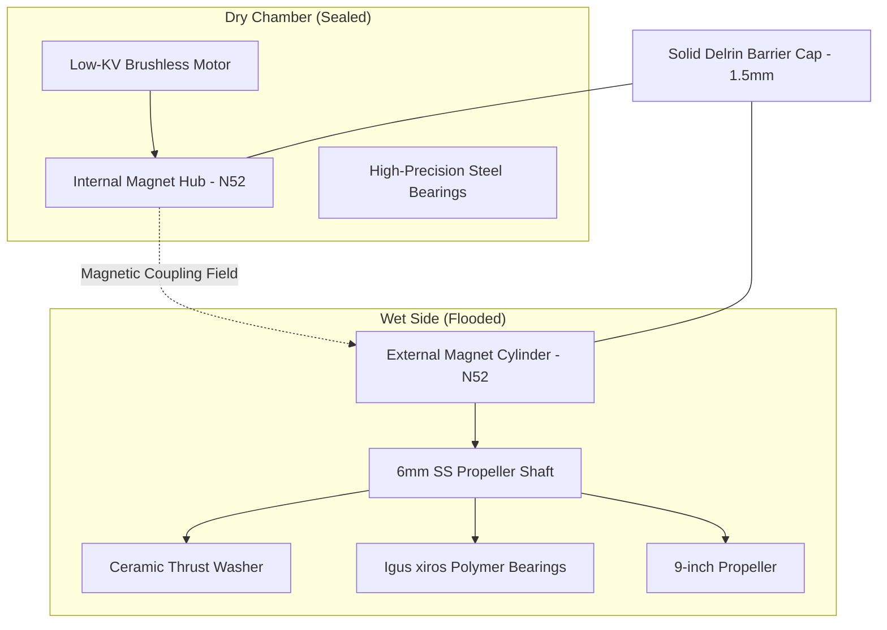

# Design Document: Coaxial Magnetic Coupling System (Option B)
## Document ID: ESD-02-B
## Revision: 1.0

This document defines the complete technical design, mechanical integration, magnetic calculations, and fabrication instructions for the **Coaxial Magnetic Coupling Propulsion System (Option B)** of the Blue-Water Rover ASV.

---

## 1. Mechanical & Watertight Design

### 1.1 Structural Layout
Option B utilizes a dry motor compartment. Torque is transferred through a non-penetrated Delrin end cap using an array of neodymium magnets.

### 1.2 Watertight O-Ring Seal Specification
To ensure absolute watertight integrity at depth, the dry chamber end cap is secured using a **dual radial O-ring gland**:
*   **O-Ring Standard**: AS568-152 (Nitrile NBR, 70 Durometer).
    *   *Cross Section ($d_2$)*: $2.62\text{ mm}$
    *   *Inner Diameter (ID)*: $82.22\text{ mm}$
*   **Gland Machining Specifications**:
    *   *Radial Gland Depth*: $2.02\text{ mm}$ (achieves $23\%$ radial compression).
    *   *Groove Width*: $3.60\text{ mm}$ (provides $20\%$ volumetric clearance for O-ring expansion under hydrostatic pressure).
    *   *Lead-in Chamfer*: $15^\circ$ angle with a $1.5\text{ mm}$ length to prevent O-ring shearing during assembly.

---

## 2. Magnetic Coupling Engineering

### 2.1 Torque Transmission and Overload Slippage
The coupling utilizes a **12-pole (6 North, 6 South) radial configuration** constructed of N52 block magnets.
*   **Maximum Torque Capacity ($T_{max}$)**: Designed for **$1.8\text{ N}\cdot\text{m}$**.
*   **Slippage Safety**: If the propeller catches seaweed or marine debris:
    1.  The external hub halts.
    2.  The magnetic attraction forces slip, decoupling the internal hub from the external hub.
    3.  The internal motor spins freely at high speed without damage to the drive shaft, motor windings, or mounting brackets.
    4.  The autopilot detects the sudden drop in current draw (due to the loss of load) and triggers a clearing cycle (rapid reverse pulses) to clear the propeller.

### 2.2 Axial Magnetic Attraction & Thrust Bearing
The magnetic attraction between the internal and external magnet rings creates a strong axial force pulling the external hub toward the Delrin barrier cap.
*   **Axial Pull Force ($F_{axial}$)**: Calculated at **$120\text{ N}$ ($27\text{ lbs}$)** at a $2.5\text{ mm}$ air gap.
*   **Thrust Washer**: To prevent the external hub from grinding against the Delrin cap, a **silicon nitride ($Si_3N_4$) ceramic thrust ball bearing** or a **glass-filled PTFE thrust washer** is positioned between the external hub and the cap face. This absorbs the continuous axial load with a low friction coefficient ($\mu \le 0.04$).

### 2.3 Eddy Current Prevention
If a conductive metal (like aluminum or stainless steel) is used for the barrier cap, the rotating magnetic fields will induce eddy currents, leading to parasitic torque loss and high heating:
$$P_{eddy} \propto \frac{B^2 f^2 d^2}{\rho}$$
*   **Material Selection**: The barrier cap must be machined from **Unfilled PEEK** or **Delrin (POM-C)**. These polymers are non-conductive, eliminating eddy current losses ($0\text{ W}$ loss) and preventing thermal degradation of the neodymium magnets (which begin permanent demagnetization at $80^\circ\text{C}$).

---

## 3. Step-by-Step Assembly & Testing Guide

### 3.1 Dry Chamber Machining & Alignment
1.  **Chamber Preparation**: Cut the 3-inch SDR-35 PVC pipe to length. Machine the inner face to receive the Delrin end cap gland.
2.  **Barrier Cap Machining**: Lathe-machine the Delrin end cap. Turn down the front face where the magnets overlap to a wall thickness of exactly $1.5\text{ mm}$. Machine the radial O-ring grooves to a depth of $2.02\text{ mm}$.
    *   *Alternative (3D-Printed Nylon)*: If 3D printing the barrier cap in PA12 or PA12-CF, print the part solid (100% infill) and slightly oversized. Post-machine the O-ring grooves and sealing faces on a lathe using sharp carbide tooling and a high feed rate to avoid melting, then seal the part in marine epoxy. Refer to the [3D Printing Reference Document](file:///workspaces/BWR_ASV/docs/pontoon_3d_print_evaluation.md#L68-L76) for specific plastic lathe turning settings.
3.  **Internal Hub Assembly**: Secure the 12 internal N52 magnets to the mild steel back-iron ring using high-strength retaining compound (Loctite 680). Mount the hub onto the brushless motor shaft.
4.  **Dry Assembly**: Install the motor in the PVC chamber. Push the Delrin cap into the chamber until it is flush, checking that the air gap between the internal magnets and the cap face is exactly $0.5\text{ mm}$.

### 3.3 Wet-Side Assembly & Seawater Seal Testing
1.  **Wet-Side Bracket**: 3D-print the wet-side propeller shaft support bracket in ASA at $100\%$ infill. Press-fit the dual Igus xiros polymer bearings into the bracket.
2.  **External Hub Assembly**: Secure the 12 external N52 magnets to the external back-iron ring. Cast the hub in marine epoxy and wrap it in carbon fiber to prevent saltwater ingress.
3.  **Shaft Installation**: Slide the $6\text{mm}$ stainless steel shaft through the polymer bearings, slide the ceramic thrust washer on, and secure the external magnet hub to the shaft.
4.  **Pressure Testing**: Assemble the dry chamber. Submerge the sealed pod in a pressure chamber filled with water. Pressurize to $1.5\text{ bar}$ (simulating a $15\text{m}$ depth) and hold for 2 hours. Open the chamber and verify that the interior remains completely dry.

---

## 4. Bill of Materials (BOM)

| Part Name | Qty | Specification / Source | Cost |
| :--- | :--- | :--- | :--- |
| **Low-KV Brushless Motor** | 1 | 5010 75KV Brushless Motor | \$45.00 |
| **N52 Block Magnets** | 24 | N52 Neodymium ($10\text{mm} \times 10\text{mm} \times 3\text{mm}$) | \$24.00 |
| **Delrin Stock (POM-C)** | 1 | $100\text{mm}$ diameter, $150\text{mm}$ length | \$35.00 |
| **SDR-35 PVC Pipe** | 1 | 3-inch nominal diameter ($2\text{ft}$) | \$12.00 |
| **Igus xiros Bearings** | 2 | Polymer ball bearings ($6\text{mm} \times 15\text{mm} \times 5\text{mm}$) | \$18.00 |
| **Ceramic Thrust Bearing** | 1 | Si3N4 Ceramic ($6\text{mm} \times 14\text{mm} \times 5\text{mm}$) | \$15.00 |
| **NBR-70 O-Rings** | 4 | AS568-152 Nitrile O-rings | \$4.00 |
| **Stainless Steel Shaft** | 1 | 316 Ground Shafting ($6\text{mm} \times 100\text{mm}$) | \$8.00 |
| **Cruising Propeller** | 1 | APC 9x6 Carbon-Fiber Folding Propeller | \$22.00 |
| **Total Estimated Cost** | | | **\$183.00** |
