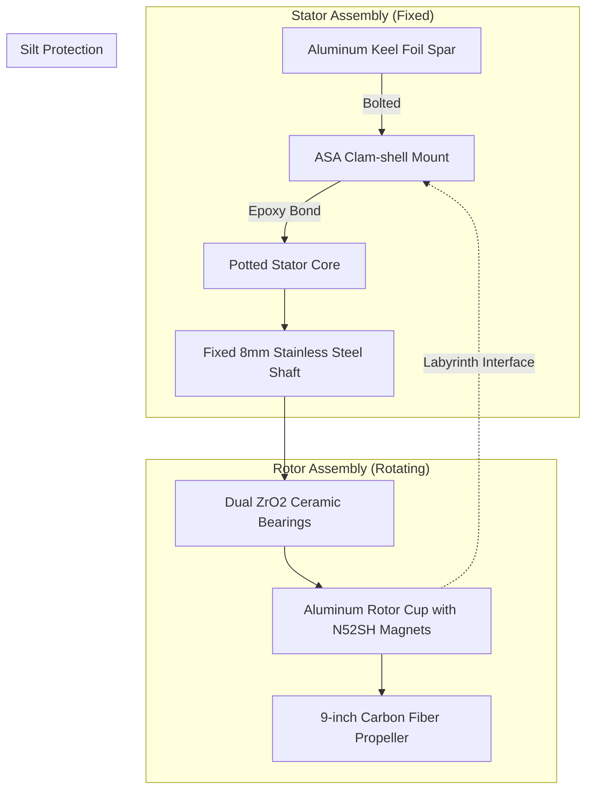

# Design Document: Potted Wet-Running Direct-Drive System (Option A)
## Document ID: ESD-02-A
## Revision: 1.0

This document defines the complete technical design, mechanical integration, electrical parameters, and fabrication instructions for the **Potted Wet-Running Direct-Drive Propulsion System (Option A)** of the Blue-Water Rover ASV.

---

## 1. Mechanical Integration & Hydrodynamics

### 1.1 Structural Assembly
Option A uses a "flooded-rotor" design. The stator is permanently fixed and potted inside a central core, while the rotor cup and propeller spin directly in seawater around it.

### 1.2 Keel Spar Attachment
*   **Mounting Collar**: A hydrodynamic, split-clam shell collar printed in **ASA (Acrylonitrile Styrene Acrylate)** at $100\%$ infill. 
*   **Attachment**: Clamps to the bottom of the $8\text{mm}$ 6061-T6 aluminum foil spar. It is secured using two M5 $\times$ $25\text{mm}$ 316 stainless steel shoulder bolts passing through pre-drilled holes in the foil spar.
*   **Hydrodynamic fairing**: The collar transitions smoothly into a nose cone profile to minimize frontal area drag.

### 1.3 Labyrinth Silt-Exclusion Seal
To prevent sand and micro-algae from entering the $0.8\text{ mm}$ gap between the stator and rotor, the assembly incorporates a **labyrinth seal**:
*   **Geometry**: Concentric interlocking sleeves machined on the front face of the rotor cup and the rear face of the static mounting collar.
*   **Clearance**: A radial and axial gap of exactly $0.15\text{ mm}$.
*   **Function**: Centrifugal forces from the spinning rotor cup throw entering particles outward, while the winding path prevents suspended silt from settling in the motor air gap.

---

## 2. Electrical, ESC & Thermal Specifications

### 2.1 Wiring and Conduit
*   **Phase Leads**: Three $16\text{ AWG}$ extra-flexible silicone-insulated copper wires.
*   **Conduit**: The wires exit the rear of the stator potting, run inside a protective polyurethane sleeve, and route upwards through a $5\text{mm}$ slot machined along the trailing edge of the aluminum foil spar to the deck electronics box.

### 2.2 VESC Field-Oriented Control (FOC) Configuration
To ensure smooth startup and torque tracking under water load, a VESC (or equivalent FOC ESC) must be calibrated with the following motor parameters:

| VESC Parameter | Recommended Setting | Description |
| :--- | :--- | :--- |
| **Motor Type** | FOC | Sinusoidal Field Oriented Control (sensorless) |
| **Motor Current Max**| $15.0\text{ A}$ | Limits peak current and thermal stress |
| **Absolute Max Current**| $25.0\text{ A}$ | Peak cutoff limit |
| **Motor Resistance (R)**| $\approx 0.182\ \Omega$ | Measured during motor detection |
| **Motor Inductance (L)**| $\approx 145.2\ \mu\text{H}$ | Measured during motor detection |
| **Motor Flux Linkage** | $\approx 0.0092\ \text{Wb}$ | Measured during motor detection |
| **Switching Frequency**| $25.0\text{ kHz}$ | Minimizes acoustic noise and ripple |
| **Startup Boost** | $0.08\text{ V}$ | Initial voltage offset to break static inertia |
| **Observer Gain** | $1.50$ | Increased by $50\%$ to stabilize rotor tracking in water |
| **Minimum ERPM** | $150\text{ ERPM}$ | Prevents commutation loss at low speeds |

### 2.3 Thermal Dissipation Modeling
Running a motor submerged in water offers exceptional cooling performance. The convective heat transfer coefficient of water ($h_{water}$) is:
$$h_{water} \approx 1,500\text{ W/(m}^2\cdot\text{K)}$$

The stator heat ($P_{loss}$) is conducted through the $0.8\text{ mm}$ potting layer of MG Chemicals 832TC epoxy (thermal conductivity $k = 1.44\text{ W/(m}\cdot\text{K)}$):
$$R_{thermal} = \frac{t}{k \cdot A_{stator}} \approx 0.05\text{ K/W}$$

At a continuous cruising power of $50\text{W}$ (with $\approx 10\text{W}$ of electrical copper losses):
$$\Delta T_{stator} = P_{loss} \cdot R_{thermal} \approx 10\text{ W} \cdot 0.05\text{ K/W} \approx 0.5^\circ\text{C}$$

*   **Conclusion**: Stator thermal rise is negligible. The motor can run continuously at full rating without any risk of thermal degradation, even under high ambient deck temperatures.

---

## 3. Materials & Step-by-Step Fabrication Guide

### 3.1 Potting Mold & Degassing Setup
1.  **Preparation**: Print the stator casting mold in silicone or PLA (if PLA, coat the interior with PVA mold release).
2.  **Stator Preparation**: Wrap the stator lead wires in heat-shrink tubing at the exit point to prevent epoxy wicking. Position the stator concentrically in the mold using a central alignment pin.
3.  **Epoxy Mixing**: Mix MG Chemicals 832TC Parts A & B in a 1:1 weight ratio. Mix slowly to prevent air entrapment.
4.  **Vacuum Degassing**: Place the mixed epoxy in a vacuum chamber. Pull a vacuum of $-29\text{ in Hg}$ and hold for 10 minutes. The epoxy will rise and collapse as air bubbles escape.
5.  **Pouring & Curing**: Pour the degassed epoxy into the mold slowly from one side to prevent air pockets. Cure in a dry oven at $65^\circ\text{C}$ for 4 hours (or at room temperature for 24 hours).
6.  **Turning**: Mount the cured stator on a lathe. Turn down the outer epoxy surface until the outer diameter is smooth and matches the target air-gap clearance.

### 3.2 Ceramic Bearing Fitting
1.  Use **full $ZrO_2$ (Zirconium Dioxide) open bearings** ($8\text{mm} \times 16\text{mm} \times 5\text{mm}$).
2.  Do not use any grease, oil, or shields.
3.  Press-fit the bearings into the rotor cup seats using a dedicated bearing press tool. Ensure the outer race is supported during installation to avoid cracking the ceramic rings.

### 3.3 Rotor Magnet Encapsulation
1.  Verify the N52SH magnets are free of surface defects. Glue them into the aluminum rotor cup using marine epoxy (West System 105/205).
2.  Wrap the outer surface of the magnets with $0.2\text{mm}$ carbon-fiber prepreg tape, tensioning it tightly.
3.  Cure the wrap at $80^\circ\text{C}$ to shrink and bond the carbon fiber, forming a permanent hoop-stress sleeve that prevents magnets from delaminating or corroding.

---

## 4. Bill of Materials (BOM)

| Part Name | Qty | Specification / Source | Cost |
| :--- | :--- | :--- | :--- |
| **Brushless Motor Stator** | 1 | 5010 Outrunner (Rebuilt) | \$35.00 |
| **MG Chemicals 832TC** | 1 | Thermally Conductive Epoxy | \$65.00 |
| **Full Ceramic Bearings** | 2 | ZrO2 Open ($8\text{mm} \times 16\text{mm} \times 5\text{mm}$) | \$32.00 |
| **Carbon Fiber Prepreg Tape**| 1 | $10\text{mm}$ width, $1\text{m}$ length | \$12.00 |
| **3D Printing Filament** | 1 | ASA filament ($1\text{ kg}$) | \$35.00 |
| **Stainless Steel Shaft** | 1 | 316 Ground Shafting ($8\text{mm} \times 120\text{mm}$) | \$10.00 |
| **Folding Propeller Hub** | 1 | Carbon Fiber folding prop assembly | \$25.00 |
| **Zinc Anode Collar** | 1 | $50\text{ g}$ shaft anode ($8\text{mm}$ ID) | \$8.00 |
| **Total Estimated Cost** | | | **\$222.00** |
