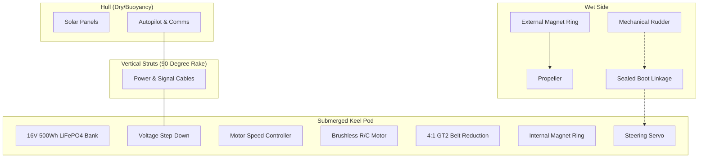
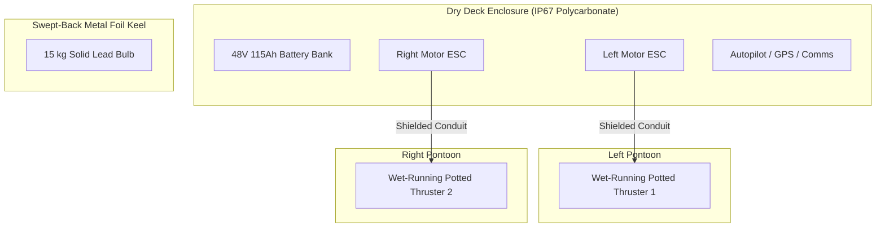
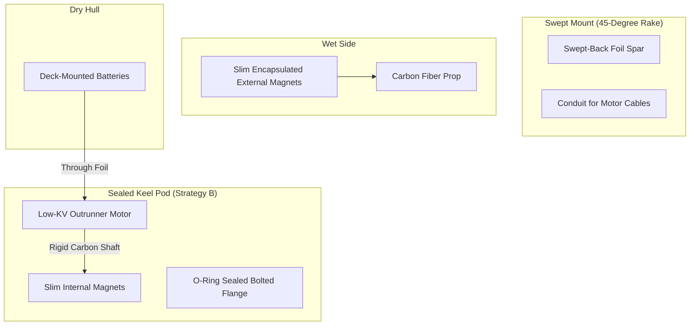

# Engineering Analysis: SeaCharger Keel Design Improvements

This document evaluates the original battery/motor keel design of the **SeaCharger** (Pacific crossing, 2016) and proposes structural, mechanical, and electrical improvements to overcome its key vulnerabilities for long-endurance autonomous voyages.

---

## 1. The Original SeaCharger Keel Design
The SeaCharger utilized a single horizontal submerged pod (a sealed PVC tube) suspended beneath the fiberglass-coated foam hull by vertical carbon fiber struts. 

### Key Components:
1. **Power Vault**: A 16V, 500Wh battery bank composed of fifty 26650 LiFePO4 cells packed inside the front of the submerged PVC tube.
2. **Propulsion**: A brushless R/C airplane outrunner motor (Cobra) driving a 4:1 belt reduction drive (GT2 belt) to reduce RPM and increase torque.
3. **Waterproofing (Drive)**: A custom magnetic coupling transferring torque through a solid Delrin end cap, eliminating dynamic rotating shaft seals.
4. **Waterproofing (Steering)**: A mechanical rudder steered by an internal servo, connected via a pushrod passing through a flexible rubber sealing boot.
5. **Thermal Management**: Direct cooling of the battery, ESC, and motor via conduction through the PVC pod walls to the surrounding ocean.

---

## 2. Critical Vulnerabilities & Failure Modes

### 2.1 Hydrostatic Pressure & Ingress Risk
*   **Vulnerability**: Submerging the high-voltage lithium battery bank, electronic speed controller (ESC), and solar charging circuitry at z = -450 mm places them under continuous hydrostatic pressure. 
*   **Failure Mechanism**: Thermal cycling (heating during charging/propulsion, cooling at night) creates pressure differentials inside the pod. This drives moisture through microscopic gaps in O-rings, PVC cement joints, or the rudder's rubber sealing boot. A single drop of saltwater inside the battery compartment can cause a cell short-circuit, rapid galvanic corrosion, or thermal runaway.

### 2.2 Weed & Debris Accumulation (The "Rake" Effect)
*   **Vulnerability**: The vertical carbon fiber struts and the horizontal keel pod form a 90-degree bracket.
*   **Failure Mechanism**: In open water, this acts as a rake, catching sargassum, giant kelp, plastic bags, and abandoned fishing lines. The accumulated debris increases hydrodynamic drag exponentially, stalling the vessel and causing the motor to draw excess current, depleting the batteries.

### 2.3 Mechanical Timing Belt Wear
*   **Vulnerability**: The 4:1 GT2 timing belt is a high-wear component operating in an unventilated, high-humidity, warm environment.
*   **Failure Mechanism**: Over a multi-month crossing (millions of revolutions), timing belts stretch, strip teeth, or snap. Sudden load spikes (such as the propeller hitting debris or getting tangled in weeds) can immediately strip the teeth off the small motor pulley, disabling propulsion.

### 2.4 Magnetic Coupling Slip & Parasitic Shear Drag
*   **Vulnerability**: The magnetic coupling relies on the attraction between internal and external neodymium magnets.
*   **Failure Mechanism**: 
    1.  **Torque Slipping**: If the propeller strikes weeds or debris, the torque required exceeds the coupling limit, causing the magnets to slip. Once decoupled, the motor spins at maximum RPM without transmitting thrust, which can melt the belt or bearings before the autopilot detects the slip.
    2.  **Parasitic Drag**: Spinning a large, wet-side magnetic cylinder in water creates high shear-layer drag, reducing overall drive efficiency.

### 2.5 Rudder Linkage & Servo Wear
*   **Vulnerability**: A physical rudder requires an external shaft, mechanical hinges, and a sealing boot.
*   **Failure Mechanism**: Marine fouling (barnacles, tubeworms) grows on the rudder hinges and shaft, increasing friction until the steering servo jams or burns out. The rubber sealing boot is vulnerable to puncture by marine life, fish bites, or UV degradation, leading to immediate flooding of the stern pod chamber. *(This is the primary failure that disabled SeaCharger during its New Zealand voyage).*

---

## 3. Recommended Design Improvements

To resolve these vulnerabilities, we can pursue two main redesign paths depending on the hull configuration: **Strategy A (The Catamaran/Option F Paradigm)** or **Strategy B (The Refined Monohull Keel)**.

---

### Strategy A: The Catamaran Paradigm (Differential Propulsion)
*This is the approach adopted by the BWR Option F design, which splits and simplifies the system to bypass the failure points of a submerged battery/motor pod.*

1.  **Relocate Batteries to the Deck**: Move the 35 kg battery bank out of the water into a gasket-sealed, IP67 deck-mounted polycarbonate box. This removes them from hydrostatic pressure. Use a Gore-Tex breathing vent to equalize internal pressure without admitting moisture.
2.  **Use Solid, Non-Electric Ballast**: To maintain self-righting physics without risking the batteries, hang a **solid 15 kg lead bulb** at the bottom of the keel. If the bulb casing is gouged or leaks, there is zero risk of electrical failure.
3.  **Implement Differential Steering**: Replace the single centerline motor and mechanical rudder with **dual transom-mounted thrusters** on the outer catamaran hulls.
    *   *Steering*: Directional control is achieved by varying thrust between the left and right motors, eliminating the rudder servo, mechanical linkages, and sealing boots.
    *   *Redundancy*: If one motor gets tangled or fails, the autopilot enters a single-thruster safe-return mode to crab the vessel back to land.
4.  **Adopt Wet-Running, Potted Motors**: Use thrusters with fully potted stators and water-lubricated ceramic/polymer bearings (e.g., BlueRobotics T200). These motors are designed to run fully flooded, eliminating both rotating shaft seals and magnetic couplings.

---

### Strategy B: The Refined Monohull Keel
*If a monohull layout is required, the submerged battery/motor pod must be retained but re-engineered for maximum reliability.*

#### 1. Eliminate the Belt Drive (Direct Drive, Low-KV)
*   **Improvement**: Replace the high-KV airplane motor and belt reduction with a custom-wound, **low-KV brushless outrunner motor** (e.g., 50–100 KV) coupled directly to the internal side of the magnetic coupling.
*   **Benefit**: Eliminates the timing belt, pulleys, and belt tensioners, removing the primary mechanical wear point. Low-KV motors operate efficiently at low RPMs, matching the optimal propeller speed.

#### 2. Hydrofoil Keel Spar with a 45° Sweep
*   **Improvement**: Replace the vertical struts with a single, high-strength **swept-back metal hydrofoil spar** (e.g., 6061-T6 aluminum or 316 stainless steel) raked at a **45° angle**.
*   **Benefit**: Seaweed, kelp, and fishing lines strike the leading edge of the spar and naturally slide down, shedding off the bottom of the keel pod rather than wrapping around the mount.

#### 3. Slim, Low-Drag Magnetic Coupling with Steel Back-Iron
*   **Improvement**: Optimize the magnetic coupling by using high-grade N52 neodymium magnets arranged in a Halbach array (which concentrates the magnetic field on the coupling face) paired with a mild steel back-iron.
*   **Benefit**: This allows a thicker Delrin pressure barrier (for structural strength) while retaining a high torque slip limit. Encapsulate both magnet rings in a thin layer of carbon-fiber epoxy to prevent swelling and corrosion, and streamline the wet-side housing to minimize shear-layer drag.

#### 4. Flanged O-Ring Enclosures (No Permanent Glue)
*   **Improvement**: Abandon permanently glued PVC joints. Use precision-machined aluminum or thick-walled Delrin end caps with double radial O-ring seals, secured by stainless steel bolts into threaded inserts.
*   **Benefit**: Allows rapid access for maintenance, battery cell balancing, and part replacement without destroying the housing.

#### 5. Magnetostrictive or Hall-Effect Slippage Detection
*   **Improvement**: Place a Hall-effect sensor or optical encoder on the internal drive shaft, comparing its rotational speed with the motor's electrical frequency (or an external propeller speed sensor).
*   **Benefit**: If the magnetic coupling slips, the autopilot instantly detects the mismatch, cuts motor power to prevent overheating, and runs a "clearing cycle" (quick reverse pulses) to shed weeds from the propeller before re-engaging.

---

## 4. Engineering Comparison

| Feature | Original SeaCharger Keel | Strategy A (Catamaran/Option F) | Strategy B (Refined Monohull Keel) |
| :--- | :--- | :--- | :--- |
| **Enclosure Pressure** | High Hydrostatic (z = -450 mm) | Atmospheric (Deck-Mounted) | High Hydrostatic (z = -450 mm) |
| **Battery Safety** | Vulnerable to micro-leaks | Absolute Protection | Vulnerable (needs redundant chambers) |
| **Transmission Type** | 4:1 Belt Drive (GT2 Belt) | Direct Drive (Wet-Running Rotor) | Direct Drive (Low-KV Motor) |
| **Steering Mechanism** | Single Rudder + Servo + Boot | Differential Thrust (Rudderless) | Centerline Rudder or Thruster Rotation |
| **Weed Shedding** | Poor (Vertical struts catch debris) | Excellent (45° Swept Metal Spar) | Excellent (45° Swept Metal Spar) |
| **Propulsion Redundancy**| Zero (Single motor/propeller) | High (Dual independent motors) | Zero (Single motor/propeller) |
| **Maintenance Access** | Difficult (Glued PVC joints) | Simple (Deck-accessible hatches) | Medium (Bolted Flange + O-Rings) |

---

## 5. Summary Recommendation for the Blue-Water Rover
For the Charleston-to-Tampa Bay open-ocean crossing, **Strategy A (Option F)** is the highly recommended path. Moving the heavy batteries to the deck and using a solid lead bulb for self-righting eliminates the hydrostatic leak hazard, while the dual wet-running thrusters completely bypass the belt wear, magnetic coupling slip, and rudder failure modes that compromised the SeaCharger.
