# Software Architecture & Control System Guide
## Project Blue-Water Rover (BWR) ASV
## Target Audience: Middle School Students to Senior Systems Engineers

Welcome to the control system guide for the Blue-Water Rover (BWR) Autonomous Surface Vehicle (ASV)! This guide explains how the software codebase in the [/src/](file:///workspaces/BWR_ASV/src/) folder works. 

Whether you are a middle school student curious about robotics or a senior systems engineer analyzing thread safety, this document will help you understand how the vessel navigates, detects obstacles, and communicates.

---

## 1. High-Level Concept: The Robotics Analogy

To understand how our software works, we can compare the different code files to parts of a human body or an RC pilot:

| Code File | Robotic Part | Human Analogy | What it does |
| :--- | :--- | :--- | :--- |
| [main.py](file:///workspaces/BWR_ASV/src/main.py) | **The Brain** | Central Nervous System | Coordinates all components, decides between auto/manual modes, and serves the HUD dashboard. |
| [spektrum_rc.py](file:///workspaces/BWR_ASV/src/spektrum_rc.py) | **The Reflexes** | Listening for instructions | Listens to a human pilot holding a Spektrum remote control. |
| [navigation.py](file:///workspaces/BWR_ASV/src/navigation.py) | **The Map & Compass** | Inner Ear & Navigation sense | Reads NMEA GPS strings, figures out where the target is, and calculates how much to steer the rudder. |
| [perception.py](file:///workspaces/BWR_ASV/src/perception.py) | **The Eyes** | Depth Vision | Scans the water using an Intel RealSense D455 depth camera to see if any obstacles are in the way. |
| [drive_control.py](file:///workspaces/BWR_ASV/src/drive_control.py) | **The Muscles** | Hands on the steering wheel | Sends electrical Pulse Width Modulation (PWM) signals to push the motor and turn the rudder. |

---

## 2. Software Architecture Topology

The software runs on a companion computer (Raspberry Pi 4) inside the IP67 control box. It executes multiple concurrent threads, using thread-safe locks (`threading.Lock`) to exchange telemetry.

```mermaid
graph TD
    subgraph Threads running at 10Hz - 60Hz
        RC[spektrum_rc.py Thread<br/>Parses Spektrum serial bytes]
        Nav[navigation.py Thread<br/>Parses GPS & runs Heading PID]
        Percep[perception.py Thread<br/>Reads D455 Depth frame buffers]
    end

    subgraph Core Execution Loop 10Hz
        Main[main.py Autopilot Loop<br/>Selects Mode, Fuses Steering Vectors]
        Drive[drive_control.py<br/>Controls ESC / Servo PWM]
        
        RC -->|Shared state| Main
        Nav -->|Shared state| Main
        Percep -->|Shared state| Main
        
        Main -->|Action vectors| Drive
    end

    subgraph Interfaces & APIs
        Flask[main.py Flask Server<br/>Web Dashboard HOST]
        Mesh[comms/telemetry_handler.py<br/>MeshCore Serial Parser]
        
        Main <-->|Telemetry stats| Flask
        Main <-->|Uplink commands| Mesh
    end

    style Main fill:#0d2137,stroke:#00e5ff,stroke-width:2px;
    style Flask fill:#1e1b18,stroke:#ffb300,stroke-width:2px;
```



---

## 3. How the Key Systems Work

### 3.1 Reading the Remote Control: Serial Sync & Bit Shifting
**Middle School View**: The remote control transmitter sends wireless packets to a receiver on the boat. The receiver repeats these messages to our computer. Because characters can get jumbled in translation, the code waits for a "quiet moment" in the conversation (a time gap of 5 milliseconds) to know a new instruction package has begun.

**Senior Engineer View**: The Spektrum Satellite serial protocol operates at 115200 baud, sending 16-byte frames containing 7 proportional channels. Since UART is an asynchronous byte stream, aligning bytes requires a frame synchronization heuristic. The parser tracks byte arrival times; if `current_time - last_byte_time > 0.005` seconds, the buffer is flushed and the next byte is marked as byte 0.

Each channel is parsed as a 2-byte big-endian word:
```python
# Extract channel ID and 11-bit value from DSMX frame word
chan_id = (word >> 11) & 0x0F
value = word & 0x07FF  # values from 0 to 2047
```
If no valid frame arrives for 1.0 second, a connection watchdog triggers a safety fallback, centering the rudder and cutting throttle to neutral.

### 3.2 Autopilot Steering: PID Control
**Middle School View**: Imagine walking down a path toward a target flag. If a gust of wind blows you to the left, your brain senses the error and tells your legs to steer right. The closer you get, the less you need to correct. Our boat does this with a math formula called **PID (Proportional, Integral, Derivative) Control** to decide how much to turn the rudder:
*   **Proportional (P)**: Turn more if the heading error is large.
*   **Integral (I)**: Turn extra if wind or waves have been pushing us off-course for a long time.
*   **Derivative (D)**: Counter-steer to slow down the turn as we approach the correct direction, preventing the boat from zig-zagging.

**Senior Engineer View**: The navigation controller uses the Haversine formula to compute the distance $d$ and initial bearing $\theta_{bearing}$ between the boat $(Lat_1, Lon_1)$ and target waypoint $(Lat_2, Lon_2)$. The heading error is computed relative to the Course Over Ground (COG) and wrapped to $[-180, 180]$ degrees:
```python
heading_error = target_bearing - current_cog
heading_error = (heading_error + 180) % 360 - 180
```
The PID loop calculates the rudder correction:
$$u(t) = K_p \cdot e(t) + K_i \int e(t)dt + K_d \frac{de(t)}{dt}$$
*   **Anti-Windup**: The integral error sum is clamped to $[-30, 30]$ degrees to prevent integrator saturation during long turns.
*   **Output**: The final steering fraction $u(t)$ is clamped to $[-1.0, 1.0]$ representing full left/right rudder deflection.

### 3.3 Obstacle Avoidance: RealSense Proximity Grid
**Middle School View**: The Intel RealSense camera works like a bat's ears, but uses light instead of sound. It shines invisible infrared patterns and measures how long it takes for the patterns to bounce back. The code cuts this visual image into three vertical blocks: **Left**, **Center**, and **Right**. If an object appears closer than 8 meters, the autopilot swerves in the opposite direction.

**Senior Engineer View**: We stream depth buffers at a $640 \times 480$ resolution. To avoid water-surface glint (reflections) and sky noise, the scan checks only pixels in the vertical center band ($160 \le y \le 320$). The columns are partitioned into three sectors: Left $[0, 213]$, Center $[214, 426]$, and Right $[427, 639]$. 

If an obstacle is detected in the Center sector at a distance $D_{center} < D_{avoid}$:
*   Compare Left and Right sectors.
*   Apply steering offset offset toward the clearer side:
    $$\theta_{avoid} = \pm 0.8 \cdot \left(1.0 - \frac{D_{center}}{D_{avoid}}\right)$$
*   If the center obstacle distance drops below 4.0 meters, the drive controller triggers an emergency reverse throttle fraction ($-0.2$) to back off.

### 3.4 Motor Control: Pulse Width Modulation (PWM)
**Middle School View**: How do we tell an electric motor how fast to spin, or a rudder motor what angle to hold? We send them tiny pulses of electricity. A 1.5 millisecond pulse (1500 microseconds) means "stop" or "center". A longer pulse (2000 microseconds) means "full speed forward" or "turn right". A shorter pulse (1000 microseconds) means "full speed backward" or "turn left". Repeating this pulse 50 times every second is called Pulse Width Modulation.

**Senior Engineer View**: The Pi uses the `pigpio` library to generate hardware-timed PWM signals via the DMA (Direct Memory Access) controller. This bypasses Linux kernel execution scheduling jitter, preventing the rudder servo from vibrating or twitching. 
*   **Current Protection Slew Limit**: Sudden throttle changes from 0% to 100% can draw massive current spikes, potentially crashing the computers. The drive controller applies a rate-limit (slew rate) of $500\text{ us/second}$, forcing the throttle output to ramp up smoothly over 1.0 second.

---

## 4. The HUD Mission Control Web Dashboard

To monitor the boat in real-time, the system starts a Flask web server on port 5000:
1.  **Backend (Python)**: `main.py` hosts a JSON API `/api/telemetry` which aggregates variables from the RC, GPS, Navigation, and RealSense threads, and `/api/command` which accepts commands from the browser.
2.  **Frontend (HTML/CSS/JS)**: Accessing `http://<pi_ip>:5000/` loads the glassmorphic dark-mode HUD dashboard:
    *   **Circular gauges** render battery capacity and solar power levels.
    *   **Rotating needles** show heading and bearings.
    *   **Sonar indicators** glow red if obstacles approach.
    *   An **SVG projection** maps the coordinates of the boat onto the coastline map.
